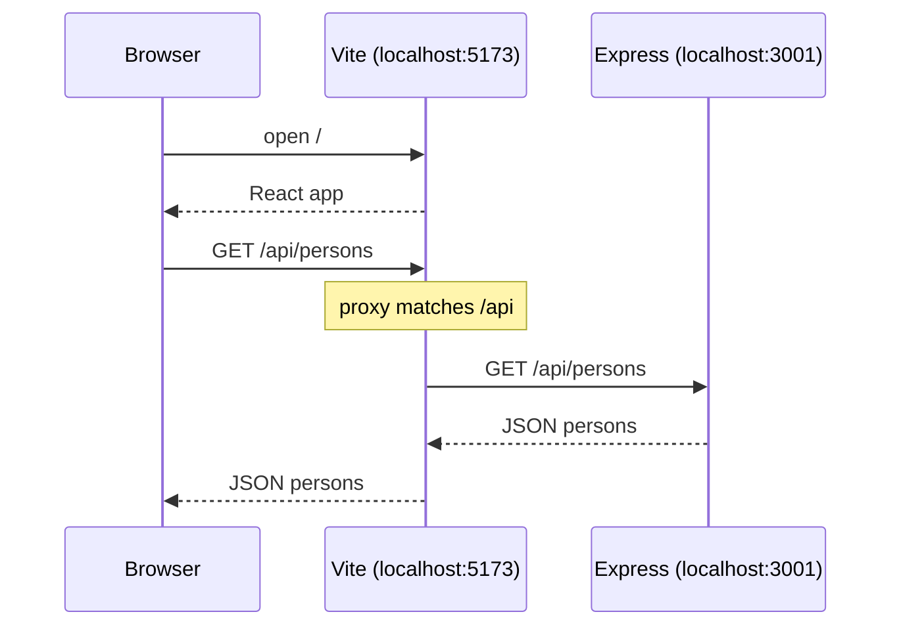
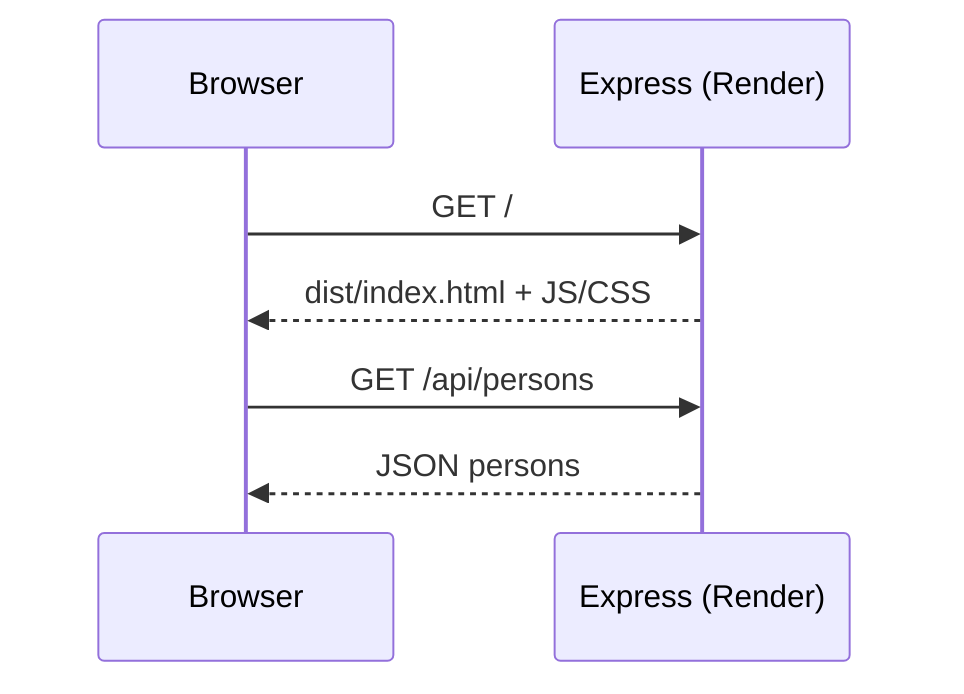

# Phonebook Backend API

Express REST API for the Full Stack Open phonebook (Part 3) — CRUD
endpoints, MongoDB persistence, Mongoose validation, ESLint, and a
production UI served from `dist`.

## Tech stack
Node.js · Express · MongoDB / Mongoose · morgan · dotenv · ESLint · Render

## Running locally
npm install
npm run dev

## Deployed Version
https://phonebook-backend-b97t.onrender.com/api/persons

## API

| Method | Route            | Description             |
|--------|------------------|-------------------------|
| GET    | `/api/persons`   | List all persons        |
| GET    | `/api/persons/:id` | Get one person        |
| POST   | `/api/persons`   | Add person (validated)  |
| PUT    | `/api/persons/:id` | Update a person       |
| DELETE | `/api/persons/:id` | Remove person         |
| GET    | `/info`          | Entry count + timestamp |

## What I built
- REST endpoints with proper status codes (200, 204, 400, 404)
- MongoDB persistence with Mongoose models
- Schema validation: name length ≥ 3, phone numbers of the form `XX-XXXXXXX` / `XXX-XXXXXXX`
- Error-handler middleware for `CastError` and `ValidationError`
- Middleware pipeline: CORS, static files, JSON parsing, morgan
- Custom morgan token to log POST request bodies
- Production frontend served from `dist` on the same Express host
- ESLint (recommended + stylistic rules) with `npm run lint`

## What I learned
- The backend is just another Node process: middleware runs in order, and `next(error)` is how async failures reach a shared error handler.
- Checking required fields in the route is not the same as schema validation — Mongoose `minLength`, `required`, and a custom number validator catch bad data at save time, including updates that go through `document.save()`.
- A relative `/api` URL is enough once Express serves both the built UI and the API; Vite’s proxy is only a development trick.
- ESLint is a project contract, not an editor preference: `--fix` handles indent and quotes; unused parameters need a real decision (`omit` them, or prefix `_` when arity matters).
- `people.find() buffering timed out` usually means Mongo never connected. Atlas DNS / Wi‑Fi blips show up as `ENOTFOUND` on a shard host; the app can still listen on 3001 while `mongoose.connect` is pending, so a request can crash Node if the query has no `.catch()`.
- Do not log `MONGODB_URI` — it includes credentials. Log that you are connecting, not the URL.

## Client–server lifecycle

The frontend uses a relative API URL (`/api/persons`). Where that request actually goes depends on the environment.

### Development (`npm run dev`)

Vite serves the React app on port **5173**. Express runs separately on port **3001**. The Vite proxy catches `/api` requests and forwards them to Express.

### Production (Render)

Vite is not running. Express serves the built UI from `dist` **and** handles the API on the same host. No proxy needed — relative `/api` already hits Express.

| Environment | Serves UI | Handles `/api` | Proxy? |
|-------------|-----------|----------------|--------|
| Dev | Vite `:5173` | Express `:3001` | Yes — Vite forwards `/api` |
| Prod | Express (`dist`) | Express | No — same server |