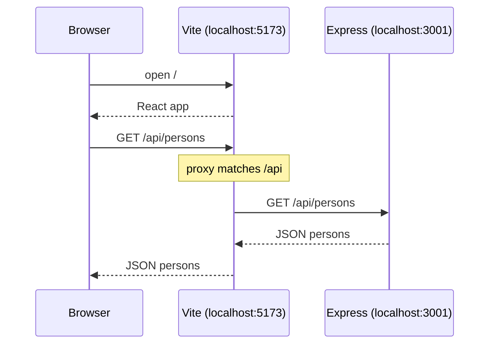
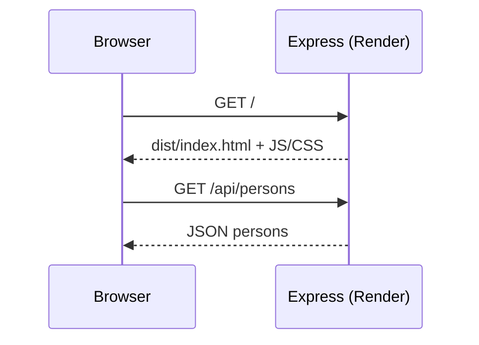

# Phonebook Backend API

Express REST API for the Full Stack Open phonebook — CRUD endpoints,
input validation, and HTTP request logging with a custom morgan token
for POST payloads.

## Tech stack
Node.js · Express · morgan · Render

## Running locally
npm install
npm run dev

## Deployed Version
https://phonebook-backend-b97t.onrender.com/api/persons

## API

| Method | Route            | Description             |
|--------|------------------|-------------------------|
| GET    | `/api/persons`   | List all persons        |
| GET    | `/api/persons/:id` | Get one person        |
| POST   | `/api/persons`   | Add person (validated)  |
| DELETE | `/api/persons/:id` | Remove person         |
| GET    | `/info`          | Entry count + timestamp |

## What I built
- REST endpoints with proper status codes (200, 204, 400, 404)
- POST validation (required fields, unique names)
- Middleware pipeline: JSON parsing + morgan logging
- Custom morgan token to log POST request bodies

## Client–server lifecycle

The frontend uses a relative API URL (`/api/persons`). Where that request actually goes depends on the environment.

### Development (`npm run dev`)

Vite serves the React app on port **5173**. Express runs separately on port **3001**. The Vite proxy catches `/api` requests and forwards them to Express.

### Production (Render)

Vite is not running. Express serves the built UI from `dist` **and** handles the API on the same host. No proxy needed — relative `/api` already hits Express.

| Environment | Serves UI | Handles `/api` | Proxy? |
|-------------|-----------|----------------|--------|
| Dev | Vite `:5173` | Express `:3001` | Yes — Vite forwards `/api` |
| Prod | Express (`dist`) | Express | No — same server |